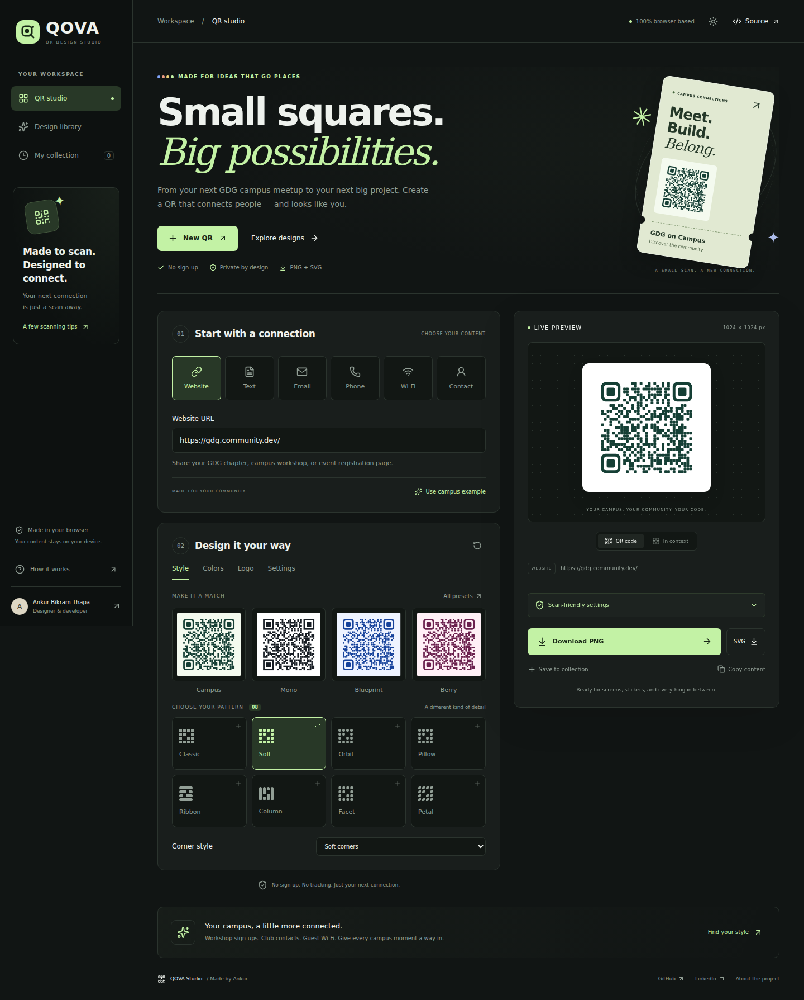
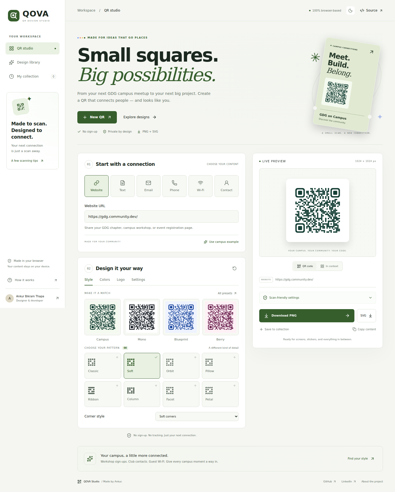
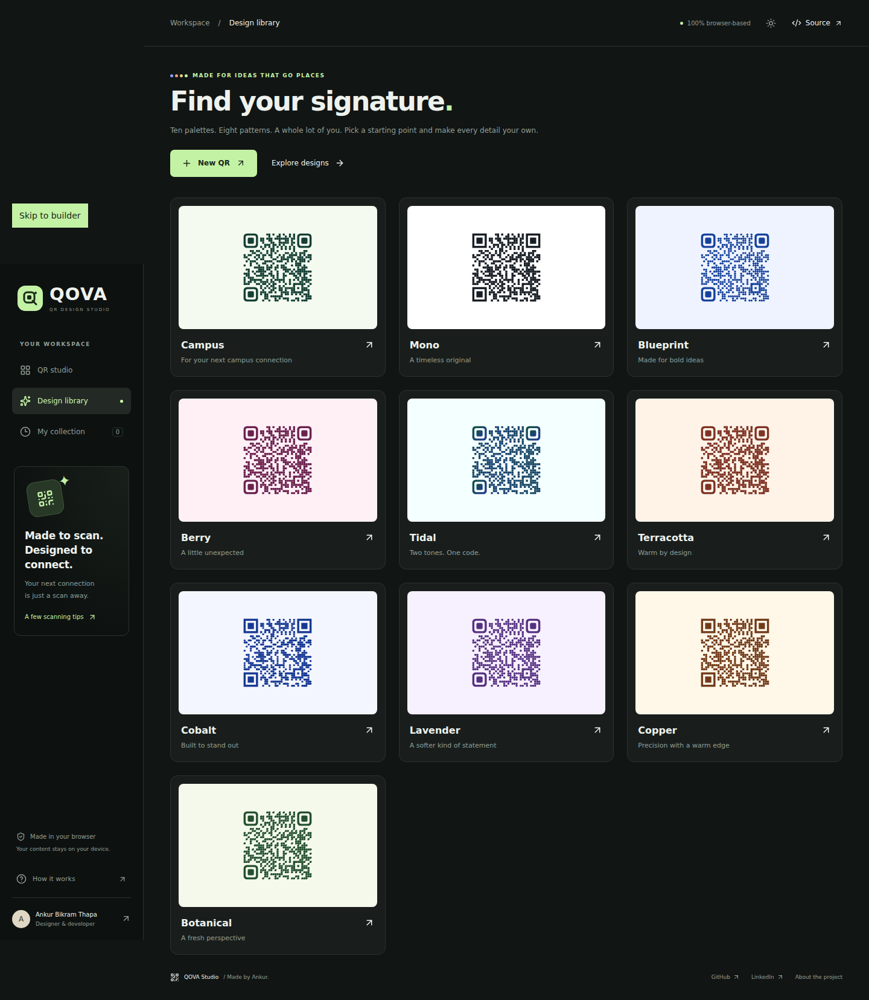
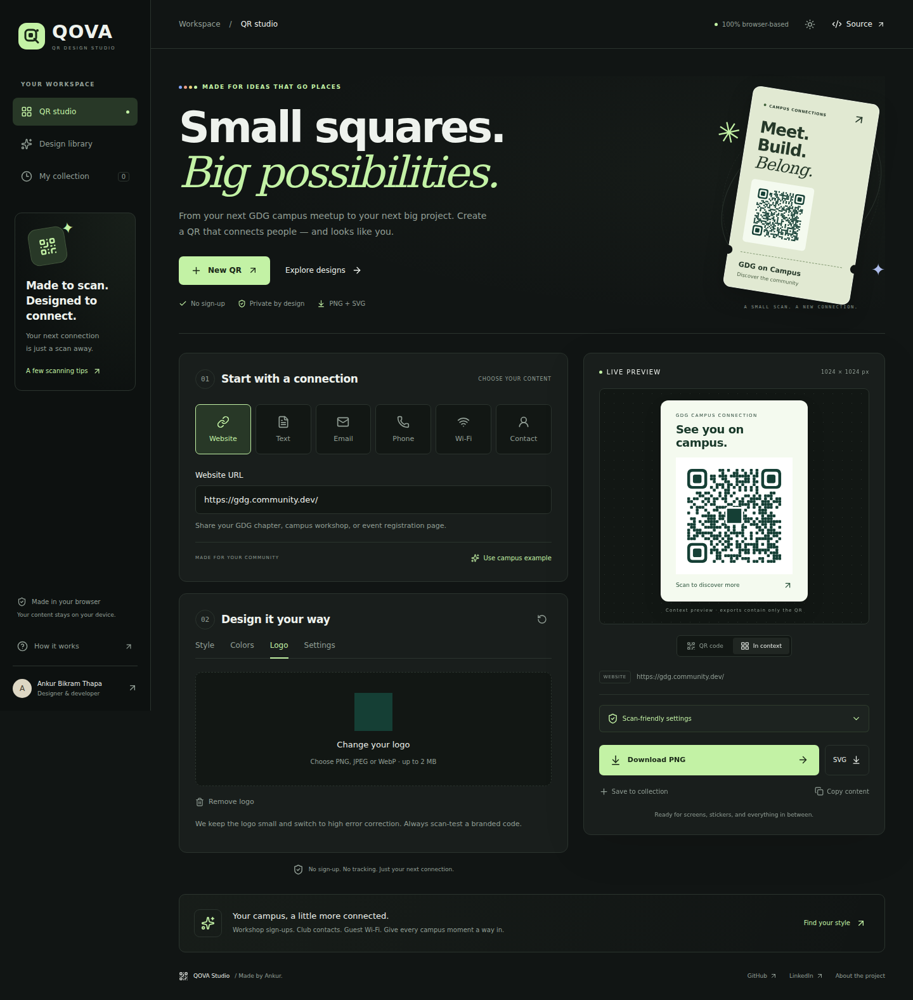
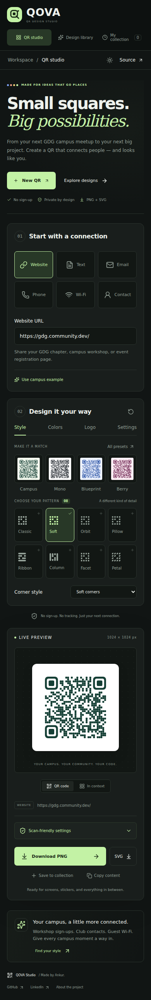

<div align="center">

# ✦ QOVA Studio

### Design QR codes that feel as good as they work.

A modern, browser-based QR design studio built with React — generate, customize, preview, save and export beautiful QR codes without a backend.

<br>

[](https://qova-sepia.vercel.app/)
[](https://github.com/abtcodermilli/qr-code-generator)

<br>

**Built for GDG on Campus SRM — Technical Recruitment 2026–27**

</div>

---

## ✨ Preview

<div align="center">



**[🚀 Open QOVA Studio](https://qova-sepia.vercel.app/)**

</div>

---

## What is QOVA?

Most QR generators stop at:

> Enter a link → Generate QR → Download.

**QOVA takes a different approach.**

It treats QR creation like a small design studio — allowing users to experiment with colors, patterns, gradients, logos, presets and QR styles while seeing every change instantly.

Everything happens directly inside the browser.

No account.  
No backend.  
No external QR-generation API.

---

## ⚡ Quick Overview

|     | Feature                       |
| --- | ----------------------------- |
| 🔗  | Multiple QR content types     |
| ⚡  | Real-time QR generation       |
| 🎨  | Advanced visual customization |
| 🧩  | Custom QR patterns            |
| 🌈  | Gradient QR codes             |
| 🖼️  | Logo support                  |
| 📱  | Responsive interface          |
| 🌙  | Light & dark themes           |
| 💾  | Local saved designs           |
| 📥  | PNG & SVG export              |
| 🛡️  | Scan-readability guidance     |
| 🧪  | Automated testing             |

---

# 🎯 QR Types

QOVA supports multiple QR formats with dynamic input fields.

### Website

Generate QR codes for URLs and websites.

### Text

Encode plain text, notes or messages.

### Email

Generate QR codes containing email information.

### Phone

Create QR codes that can open a phone dialer.

### Wi-Fi

Generate Wi-Fi QR codes using network credentials.

### Contact Card

Create contact QR codes using **vCard 3.0**.

---

# 🎨 Design Studio

QOVA gives users control over how their QR code looks while preserving the underlying QR structure.

Users can customize:

- Foreground color
- Background color
- QR size
- Quiet zone / margin
- Error correction level
- Finder corner style
- QR data pattern
- Gradient colors
- Logo
- Export resolution

All changes update the preview in real time.

---

## 🎭 Design Presets

Start quickly using one of the built-in editable themes:

| Preset    | Preset     |
| --------- | ---------- |
| Campus    | Mono       |
| Blueprint | Berry      |
| Tidal     | Terracotta |
| Cobalt    | Lavender   |
| Copper    | Botanical  |

Presets are only starting points.

Every setting can still be customized afterward.

---

## 🧩 QR Pattern System

QOVA contains **eight custom data patterns**:

`Classic` · `Soft` · `Orbit` · `Pillow`

`Ribbon` · `Column` · `Facet` · `Petal`

Finder corners can also use:

- Square
- Rounded

This allows users to create QR codes with their own visual identity instead of being limited to traditional square modules.

---

# 🖼️ Logo Support

Users can upload local:

- PNG
- JPEG
- WebP

images and place them inside the QR code.

When a logo is enabled, QOVA automatically increases error correction to help protect QR readability.

Logo processing happens locally in the browser.

---

# 🌈 Gradient QR Codes

QOVA supports optional two-color gradients.

Users can combine:

- Pattern
- Foreground colors
- Background colors
- Gradients
- Logos
- Finder styles

to create more distinctive QR designs.

---

# 🛡️ Scan Reliability

Visual customization can sometimes reduce QR readability.

QOVA includes checks that provide actionable guidance based on factors such as:

- Contrast
- Resolution
- Quiet-zone size
- Logo protection
- Error correction

Instead of pretending to guarantee scan success, QOVA warns users when a design may become harder to scan.

> Scan checks are design heuristics, not a certification or guaranteed scan-success percentage.

Important QR codes should always be tested on a real device before being printed or distributed.

---

# 📥 Export

QOVA supports:

### PNG

High-resolution raster export.

### SVG

True vector export using the same QR representation used by the live preview.

The QR code itself remains vector-based in SVG exports.

If a raster logo is uploaded, the QR geometry remains vector while the logo is embedded as an image.

---

# 💾 Saved Designs

QOVA can store recent QR designs directly in the browser.

Saved designs preserve:

- QR type
- Original content fields
- Colors
- Pattern
- Gradient
- Error correction
- Margin
- Size
- Other design settings

Up to **12 designs** can be stored locally.

Saved designs remain available after refreshing the page because they are stored using browser `localStorage`.

---

# 🌓 Light & Dark Mode

QOVA includes both:

- ☀️ Light theme
- 🌙 Dark theme

The user's theme preference is remembered locally.

---

# 📱 Responsive Design

QOVA is designed to work across different screen sizes.

Supported layouts include:

- Desktop
- Laptop
- Tablet
- Mobile

Controls, navigation and QR previews automatically adapt to smaller screens.

---

# 🛠️ Tech Stack

### Frontend


### QR & UI

- `qrcode-generator`
- Lucide icons

### Testing

- Playwright
- jsQR
- pngjs

### Storage

- Browser `localStorage`

### Deployment


---

# 🚀 Run Locally

QOVA can run on:

- Windows
- macOS
- Linux

You need:

- Node.js 22.12 or newer
- npm
- Git
- A modern browser

---

## 1. Clone the repository

```bash
git clone https://github.com/abtcodermilli/qr-code-generator.git
```

Enter the project directory:

```bash
cd qr-code-generator
```

---

## 2. Install dependencies

```bash
npm install
```

You can also use:

```bash
npm ci
```

to install the exact versions stored in `package-lock.json`.

---

## 3. Start QOVA

```bash
npm run dev
```

Vite will display an address similar to:

```text
http://localhost:5173/
```

Open that URL in your browser.

To stop the development server:

```text
Ctrl + C
```

The same commands work on **Windows, macOS and Linux**.

> Do not open `index.html` directly. QOVA is a React application and should be started through the Vite development server.

---

# 🏗️ Production Build

Create an optimized production build:

```bash
npm run build
```

The generated files will appear inside:

```text
dist/
```

Preview the production build locally:

```bash
npm run preview
```

---

# 🧪 Testing

Run the main tests:

```bash
npm test
```

Run the linter:

```bash
npm run lint
```

Verify the production build:

```bash
npm run build
```

### End-to-End Browser Tests

Install Chromium for Playwright:

```bash
npx playwright install chromium
```

Then run:

```bash
npm run test:e2e
```

Browser tests cover areas including:

- QR generation
- QR export
- Saved designs
- Persistence
- Browser interactions
- Responsive layouts

See:

- [`TEST_RESULTS.md`](TEST_RESULTS.md)
- [`DEMO_GUIDE.md`](DEMO_GUIDE.md)

for additional testing and demonstration information.

---

# 🧠 Architecture

```text
QOVA
│
├── public/
│
├── screenshots/
│
├── src/
│   ├── App.jsx
│   ├── App.css
│   ├── qr.js
│   └── storage.js
│
├── tests/
│   ├── qr.test.js
│   └── browser.mjs
│
├── index.html
├── package.json
├── vite.config.js
└── README.md
```

### Core Files

| File                | Responsibility                                               |
| ------------------- | ------------------------------------------------------------ |
| `src/App.jsx`       | Main React interface, application state and navigation       |
| `src/qr.js`         | QR encoding, matrix generation, SVG drawing and export logic |
| `src/storage.js`    | Validation and local saved-design persistence                |
| `src/App.css`       | Responsive layout, components and theme system               |
| `tests/qr.test.js`  | QR logic and storage testing                                 |
| `tests/browser.mjs` | Browser interaction and responsive testing                   |

---

# ⚙️ How QR Generation Works

QOVA uses `qrcode-generator` to create a standards-based QR matrix.

The application then renders that matrix through its own SVG renderer.

This makes it possible to apply:

```text
QR Matrix
    ↓
Custom Pattern
    ↓
Colors / Gradient
    ↓
Finder Styling
    ↓
Optional Logo
    ↓
Live SVG Preview
    ↓
PNG / SVG Export
```

PNG exports are rasterized from the same SVG representation used for the preview.

`jsQR` is also used during automated testing to independently decode exported PNG codes.

---

# 🌍 UTF-8 Support

QR encoding is configured for UTF-8.

This means QOVA can preserve content containing:

- Non-English characters
- Symbols
- Emoji

Input size is limited to approximately **1,200 UTF-8 bytes**.

---

# 🔐 Privacy

QOVA does not require:

- Accounts
- Login
- Backend servers
- External QR APIs
- URL shorteners
- Tracking

QR generation and logo processing happen directly inside the browser.

---

## Local Storage

Saved designs are stored using browser `localStorage`.

They are:

- Stored only on the current browser/device
- Not uploaded to a server
- Not synchronized between devices
- Not encrypted

Wi-Fi QR codes can contain passwords.

Users should remove stored designs or clear browser data if they no longer want sensitive QR information saved locally.

---

# ⚠️ Current Limitations

QOVA currently does not include:

- Cloud synchronization
- User accounts
- Dynamic QR redirects
- Analytics
- File hosting
- Batch QR generation

QR codes generated by QOVA are **static**.

Changing the destination requires creating and distributing a new QR code.

---

# 📸 Screenshots

## Desktop Studio


---

## Light Theme



---

## Design Library



---

## Logo & Context Preview



---

## Mobile



---

# 🌐 Deployment

The live application is deployed using **Vercel**.

### 🚀 Live Application

https://qova-sepia.vercel.app/

For a new Vercel deployment:

```text
Framework: Vite
Build Command: npm run build
Output Directory: dist
```

No environment variables or backend services are required.

---

# 🎓 GDG Recruitment Task

QOVA was created for the:

**GDG on Campus SRM — Technical Recruitment 2026–27**

Frontend task:

### QR Code Generator & Designer

The project covers the requested functionality including:

- Multiple QR types
- Real-time preview
- QR customization
- Presets
- PNG export
- Validation
- Scan-readability guidance
- Recent QR persistence
- Responsive design

Additional features include:

- SVG export
- Logo support
- Gradients
- Custom QR patterns
- Contact cards
- Light/dark themes
- Automated testing

---

# 👨‍💻 Author

<div align="center">

### Ankur Bikram Thapa

[](https://github.com/abtcodermilli)

[](https://www.linkedin.com/in/ankur-bikram-thapa-02a526380)

<br>

**[Try QOVA Studio →](https://qova-sepia.vercel.app/)**

</div>

---

## Development Note

This project was developed with AI-assisted tooling during parts of the design and development process. The implementation was reviewed, customized and tested for this project.

---

<div align="center">

### Small code. Big connection.

Built with ❤️ for **GDG on Campus SRM**

**QOVA Studio**

</div>
