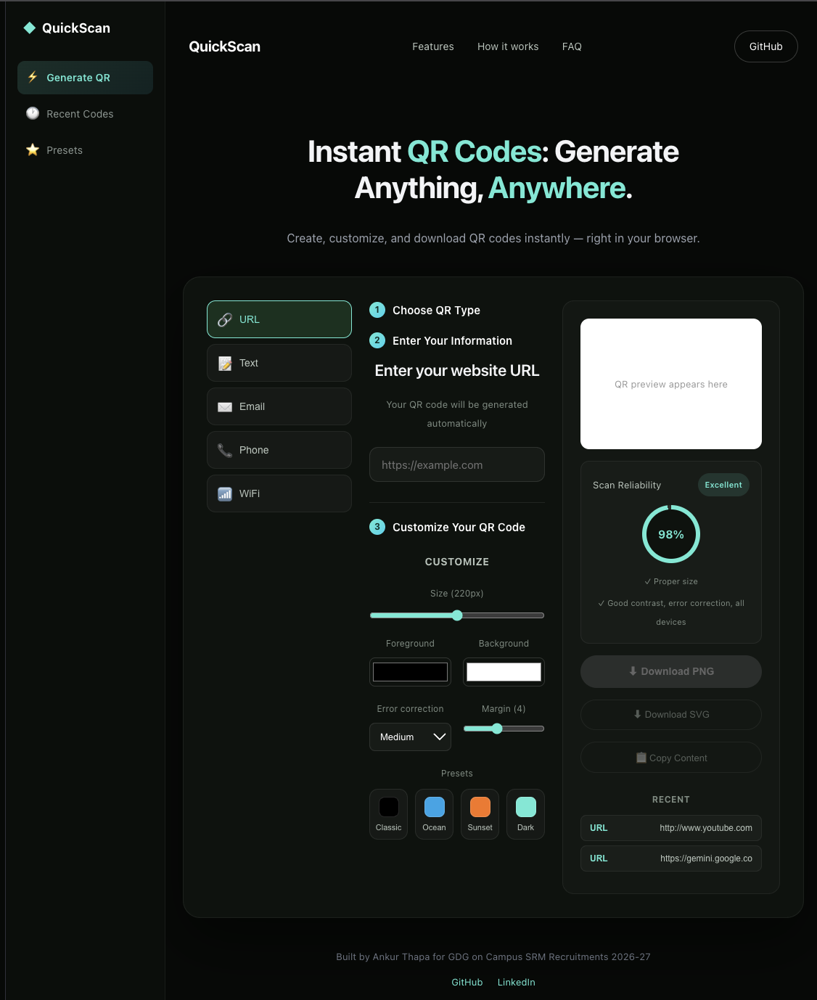
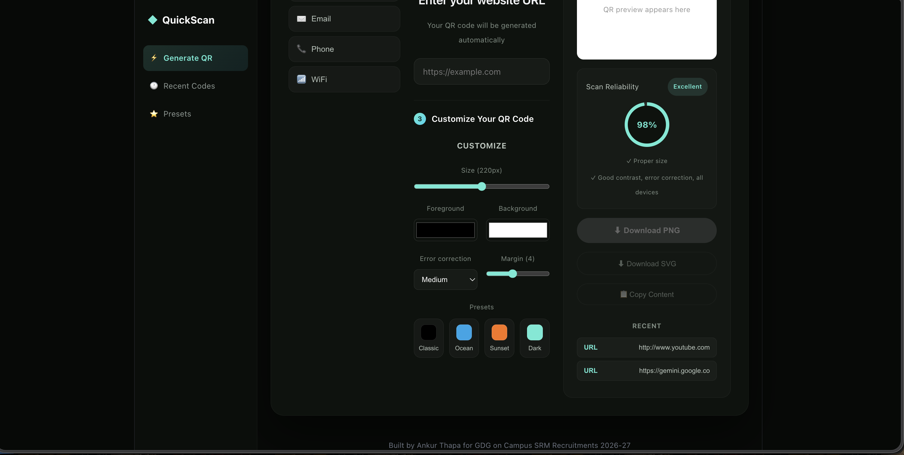
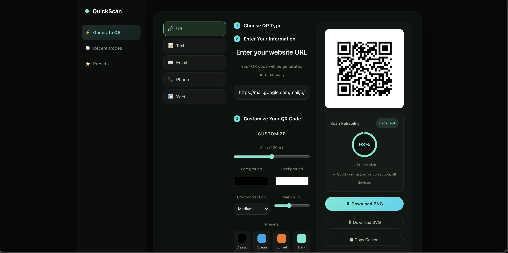

# QuickScan — QR Code Generator & Designer

A browser-based QR code generator built for the GDG on Campus SRM Technical Domain recruitment task. Generate, customize, and download QR codes for URLs, plain text, emails, phone numbers, and WiFi networks — entirely client-side, no backend required.

**Live demo:** [Add your Vercel link here once deployed]

## Features

- **Real-time QR generation** — preview updates instantly as you type
- **5 QR types** — URL, Text, Email, Phone, WiFi, each with tailored input fields
- **Full customization** — size, foreground/background color, error correction level, margin/padding, all updating the preview live
- **Presets** — Classic, Ocean, Sunset, and Dark color combinations, still editable after applying
- **Download as PNG or SVG** — downloaded file matches the live preview exactly
- **Input validation** — invalid URLs, emails, and phone numbers are flagged with clear error messages
- **Scan reliability warnings** — flags customization choices (low contrast, low error correction, low margin) that could affect scannability
- **Recent QR codes** — last 5 generated codes are saved to localStorage and persist across page refreshes; click one to reload it
- **Copy to clipboard** — copy the encoded content without downloading
- **Fully responsive** — works on desktop and mobile screen sizes

## Tech Stack

- **React** (with Vite) — component structure and state management
- **JavaScript (JSX)**
- **qrcode.react** — QR code rendering
- **CSS** — custom styling, no framework
- **localStorage** — client-side persistence for recent codes

## Getting Started

Clone the repo and run it locally:

```bash
git clone https://github.com/abtcodermilli/qr-code-generator.git
cd qr-code-generator
npm install
npm run dev
```

Then open the local URL shown in your terminal (usually `http://localhost:5173`).

## Project Structure

```
qr-code-generator/
├── src/
│   ├── App.jsx        # Main application logic and UI
│   ├── App.css         # Styling
│   ├── main.jsx        # React entry point
├── public/
├── screenshots/         # App screenshots
├── package.json
└── README.md
```

## Screenshots





## Design & Implementation Notes

- All QR type-specific data is formatted according to standard QR conventions (e.g. `mailto:`, `tel:`, `WIFI:T:WPA;S:...;P:...;;`) so scanning triggers the correct native app behavior.
- Validation runs via `useEffect`, checking URL/email/phone format live as the user types, without blocking input.
- A second `useEffect` evaluates customization choices (error correction level, margin, and foreground/background contrast) to warn users about potential scan reliability issues before they download.
- Recent codes are deduplicated by value and capped at 5 entries, stored as JSON in `localStorage`.

## Author

Built by **Ankur Bikram Thapa** for the GDG on Campus SRM Recruitments 2026-27.

- [GitHub](https://github.com/abtcodermilli)
- [LinkedIn](https://www.linkedin.com/in/ankur-bikram-thapa-02a526380)
